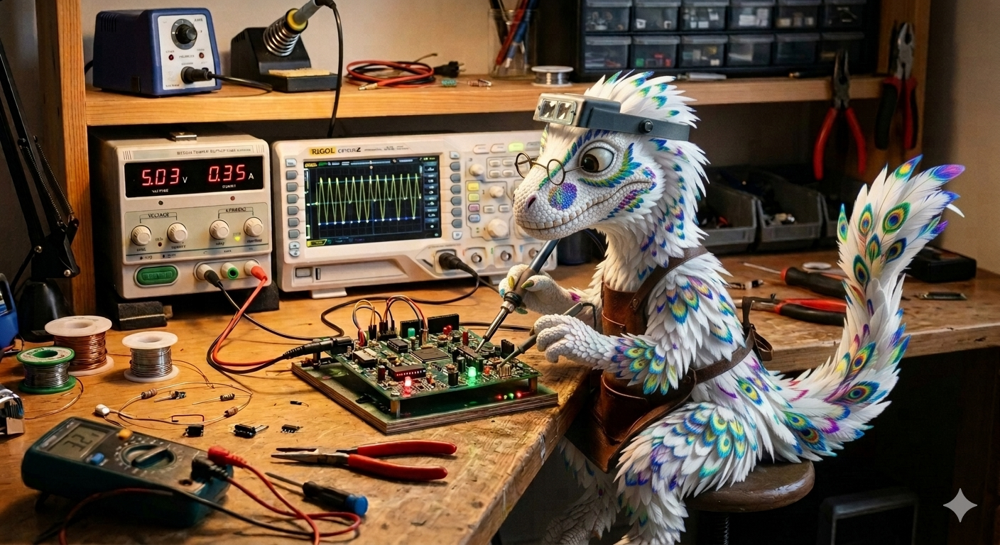

Tinkersaur-X

A place-holder for a set of software tools and hardware notes to support future hobby projects.    

If you find something useful here, feel free to use all or part of it for commercial or private use
in accordance with the MIT-License shown.

Youtube Projects

  * Convert my exercise bike into a video game controller using an infrared sensor (2025)
        - https://www.youtube.com/watch?v=mfsiq9Me8Sk&t=21s
        - The video overview on youtube has all of my notes and pictures for the project.

Steam Projects

   * Wrote a Neverwinter Nights Enhanced Edition D&D style game module named, "Castle_Crunch-Intergalactic Wizards at War"
        - Steam:  https://steamcommunity.com/sharedfiles/filedetails/?l=dutch&id=3393272837
        - Youtube:  (Cheat part 1) https://www.youtube.com/watch?v=1jqKCrOmebg
        - Youtube:  (Cheat part 2) https://www.youtube.com/watch?v=F6nTH9Xj7nc
          

Versions:

tinkersaurX - 4/4/2026 - Initial Check in.   Just setting up Git.
